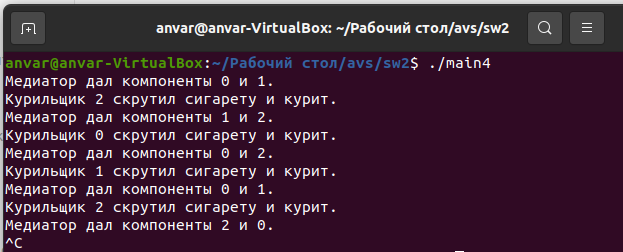
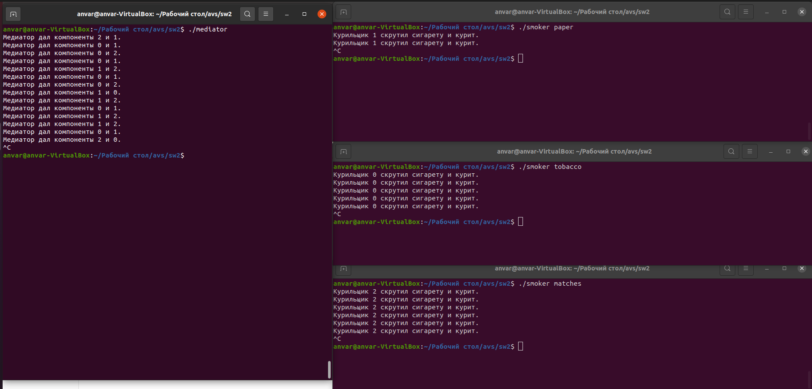

# Self Work 2

## Хасанов Анвар, БПИ216, Вариант 7

## Условие задачи:

```
Задача о курильщиках. Есть три процесса–курильщика и один
процесс–посредник. Курильщик непрерывно скручивает сигареты
и курит их. Чтобы скрутить сигарету, нужны табак, бумага и спички. 
У одного процесса–курильщика есть табак, у второго — бумага,
а у третьего — спички. Посредник кладет на стол по два разных
случайных компонента. Тот процесс–курильщик, у которого есть
третий компонент, забирает компоненты со стола, скручивает сигарету и курит. 
Посредник дожидается, пока курильщик закончит, затем процесс повторяется
```

Работа по критериям сделана на 8 баллов. Коды всех программ можно найти ниже в отчете и выше в самих файлах.

## Принцип работы программы

Для реализации данной программы создается 4 потока:

- 1 поток - работа медиатора
- 3 потока - работы курильщиков

В данной программе используется разделяемая память POSIX для хранения семафоров и флагов готовности компонентов, что обеспечивает взаимодействие между процессами. Каждый процесс-курильщик ждет сигнала на свой семафор, после чего проверяет, есть ли на столе компоненты, необходимые для скручивания сигареты. Если такие компоненты есть, курильщик забирает их со стола, скручивает сигарету и курит. Если необходимых компонентов нет, курильщик ждет следующего сигнала на своем семафоре. Посредник кладет на стол компоненты и отправляет сигналы на семафоры курильщиков, если на столе есть необходимые компоненты.

Каждый семафор и флаг готовности компонента инициализируются в начале работы программы, а затем освобождаются после завершения работы потоков курильщиков и посредника.

Для упрощения вывода данных компоненты сигареты обозначаются числами:

0 - табак

1 - бумага

2 - спички

## Результаты работы программ на 4-6 баллов



Вывод для всех программ одинаковый. Так как используются только разные виды семафоров.

## Отчет на 4 балла

Множество процессов взаимодействуют с использованием именованных POSIX семафоров. Обмен данными ведется через разделяемую память в стандарте POSIX

<details>
  <summary>Код программы</summary>

  ```c
  #include <stdio.h>
  #include <stdlib.h>
  #include <unistd.h>
  #include <pthread.h>
  #include <semaphore.h>
  #include <time.h>

  #define TOBACCO 0
  #define PAPER 1
  #define MATCHES 2

  sem_t table_smoker_semaphores[3]; // семафоры для каждого из трех курильщиков
  int table[3]; // компоненты на столе

  void *table_mediator_thread(void *arg);
  void *smoker_thread(void *arg);

  int main() {
      srand(time(NULL));
      sem_init(&table_smoker_semaphores[0], 0, 0);
      sem_init(&table_smoker_semaphores[1], 0, 0);
      sem_init(&table_smoker_semaphores[2], 0, 0);
      pthread_t table_mediator_tid;
      pthread_create(&table_mediator_tid, NULL, table_mediator_thread, NULL);
      pthread_t smoker_tids[3];
      int smoker_args[3] = {TOBACCO, PAPER, MATCHES};
      for (int i = 0; i < 3; i++) {
          pthread_create(&smoker_tids[i], NULL, smoker_thread, &smoker_args[i]);
      }
      pthread_join(table_mediator_tid, NULL);
      for (int i = 0; i < 3; i++) {
          pthread_join(smoker_tids[i], NULL);
      }
      sem_destroy(&table_smoker_semaphores[0]);
      sem_destroy(&table_smoker_semaphores[1]);
      sem_destroy(&table_smoker_semaphores[2]);
      return 0;
  }

  void *table_mediator_thread(void *arg) {
      while (1) {
          int component1 = rand() % 3;
          int component2 = rand() % 3;
          while (component2 == component1) {
              component2 = rand() % 3;
          }
          table[0] = component1;
          table[1] = component2;
          printf("Медиатор дал компоненты %d и %d.\n", component1, component2);
          sem_post(&table_smoker_semaphores[3 - component1 - component2]);
          sleep(3);
          sem_wait(&table_smoker_semaphores[3 - component1 - component2]);  
          sleep(1);
      }
  }

  void *smoker_thread(void *arg) {
      int my_component = *(int*)arg;
      while (1) {
          sem_wait(&table_smoker_semaphores[my_component]);
          sleep(2);
          printf("Курильщик %d скрутил сигарету и курит.\n", my_component);
          sem_post(&table_smoker_semaphores[my_component]);
          sleep(2);
      }
  }
  ```
</details>

## Отчет на 5 баллов

Множество процессов взаимодействуют с использованием неименованных POSIX семафоров расположенных в разделяемой памяти. Обмен данными также ведется через разделяемую память в стандарте POSIX.

<details>
  <summary>Код программы</summary>
    
  ```c
  #include <stdio.h>
  #include <stdlib.h>
  #include <unistd.h>
  #include <pthread.h>
  #include <semaphore.h>
  #include <fcntl.h>

  #define TOBACCO 0
  #define PAPER 1
  #define MATCHES 2

  sem_t *table_smoker_semaphores[3]; // семафоры для каждого из трех курильщиков
  int table[3]; // компоненты на столе

  void *table_mediator_thread(void *arg);
  void *smoker_thread(void *arg);

  int main() {
      srand(time(NULL));
      table_smoker_semaphores[0] = sem_open("tobacco_sem", O_CREAT, 0644, 0);
      table_smoker_semaphores[1] = sem_open("paper_sem", O_CREAT, 0644, 0);
      table_smoker_semaphores[2] = sem_open("matches_sem", O_CREAT, 0644, 0);
      pthread_t table_mediator_tid;
      pthread_create(&table_mediator_tid, NULL, table_mediator_thread, NULL);
      pthread_t smoker_tids[3];
      int smoker_args[3] = {TOBACCO, PAPER, MATCHES};
      for (int i = 0; i < 3; i++) {
          pthread_create(&smoker_tids[i], NULL, smoker_thread, &smoker_args[i]);
      }
      pthread_join(table_mediator_tid, NULL);
      for (int i = 0; i < 3; i++) {
          pthread_join(smoker_tids[i], NULL);
      }
      sem_close(table_smoker_semaphores[0]);
      sem_close(table_smoker_semaphores[1]);
      sem_close(table_smoker_semaphores[2]);
      sem_unlink("tobacco_sem");
      sem_unlink("paper_sem");
      sem_unlink("matches_sem");
      return 0;
  }

  void *table_mediator_thread(void *arg) {
      while (1) {
          int component1 = rand() % 3;
          int component2 = rand() % 3;
          while (component2 == component1) {
              component2 = rand() % 3;
          }
          table[0] = component1;
          table[1] = component2;
          printf("Медиатор дал компоненты %d и %d.\n", component1, component2);
          sem_post(table_smoker_semaphores[3 - component1 - component2]);
          sleep(3);
          sem_wait(table_smoker_semaphores[3 - component1 - component2]);  
          sleep(1);
      }
  }

  void *smoker_thread(void *arg) {
      int my_component = *(int*)arg;
      while (1) {
          sem_wait(table_smoker_semaphores[my_component]);
          sleep(2);
          printf("Курильщик %d скрутил сигарету и курит.\n", my_component);
          sem_post(table_smoker_semaphores[my_component]);
          sleep(2);
      }
  }
  ```
</details>

## Отчет на 6 баллов

Множество процессов взаимодействуют с использованием семафоров в стандарте UNIX SYSTEM V. Обмен данными ведется через разделяемую память в стандарте UNIX SYSTEM
V.

<details>
  <summary>Код программы</summary>
    
  ```c
  #include <stdio.h>
  #include <stdlib.h>
  #include <unistd.h>
  #include <sys/ipc.h>
  #include <sys/sem.h>
  #include <sys/types.h>
  #include <sys/wait.h>
  #include <sys/shm.h>
  #include <time.h>

  #define NUM_COMPONENTS 3
  #define NUM_SMOKERS 3

  union semun {
      int val;
      struct semid_ds *buf;
      unsigned short *array;
      struct seminfo *__buf;
  };

  struct shared_mem {
      int component1;
      int component2;
  };

  int sem_id, shm_id;
  void* shm_ptr;
  struct shared_mem* shared_memory;

  void smoker(int smoker_id, int component) {
      while (1) {
          // Ждем, пока посредник положит компоненты на стол
          struct sembuf wait_mediator = {0, -1, SEM_UNDO};
          semop(sem_id, &wait_mediator, 1);

          // Проверяем, есть ли у нас необходимые компоненты
          if (shared_memory->component1 != component && shared_memory->component2 != component &&
              shared_memory->component1 != 0 && shared_memory->component2 != 0) {
              shared_memory->component1 = 0;
              shared_memory->component2 = 0;
              printf("Курильщик %d скрутил сигарету и курит.\n", smoker_id);

              // Курим
              sleep(2);

              // Оповещаем посредника, что закончили курить
              struct sembuf notify_mediator = {0, 1, SEM_UNDO};
              semop(sem_id, &notify_mediator, 1);
          }
      }
  }

  void mediator() {
      while (1) {
          // Положим на стол два случайных компонента
          shared_memory->component1 = rand() % 3 + 1;
          do {
            shared_memory->component2 = rand() % 3 + 1;
          } while (shared_memory->component1 == shared_memory->component2);

          printf("Медиатор дал компоненты %d и %d.\n", shared_memory->component1, shared_memory->component2);

          // Оповещаем курильщиков
          struct sembuf notify_smokers = {0, NUM_SMOKERS, SEM_UNDO};
          semop(sem_id, &notify_smokers, 1);

          // Ждем, пока курильщик закончит
          struct sembuf wait_smokers = {0, 0, SEM_UNDO};
          semop(sem_id, &wait_smokers, 1);
          sleep(1);
      }
  }

  int main() {
      // Создаем и инициализируем cемафор
      sem_id = semget(IPC_PRIVATE, 1, IPC_CREAT | 0666);
      union semun sem_union;
      sem_union.val = 0;
      semctl(sem_id, 0, SETVAL, sem_union);

      // Создаем и инициализируем разделяемую память
      shm_id = shmget(IPC_PRIVATE, sizeof(struct shared_mem), IPC_CREAT | 0666);
      shm_ptr = shmat(shm_id, NULL, 0);
      shared_memory = (struct shared_mem*) shm_ptr;

      // Инициализируем генератор случайных чисел
      srand(time(NULL));

      // Создаем процессы-курильщиков
      for (int i = 0; i < NUM_SMOKERS; i++) {
          pid_t pid = fork();
          if (pid < 0) {
              printf("Ошибка при создании процесса курильщика\n");
              return 1;
          } else if (pid == 0) {
              smoker(i + 1, i + 1);
              return 0;
          }
      }

      // Создаем процесс-посредник
      pid_t pid = fork();
      if (pid < 0) {
          printf("Ошибка при создании процесса посредника\n");
          return 1;
      } else if (pid == 0) {
          mediator();
          return 0;
      }

      // Ждем завершения дочерних процессов
      for (int i = 0; i < NUM_SMOKERS + 1; i++) {
          wait(NULL);
      }

      // Освобождаем ресурсы
      semctl(sem_id, 0, IPC_RMID, sem_union);
      shmdt(shm_ptr);
      shmctl(shm_id, IPC_RMID, NULL);

      return 0;
  }
  ```
</details>

## Результаты работы программы на 7-8 баллов



Медиатор кладет на стол два компонента и подает сигнал курильщику, у которого есть недостающий компонент. После чего курильщик скуривает сигарету и посылает сигнал медиатору, чтобы он снова выложил на стол элементы

## Отчет на 7 баллов

<details>
  <summary>Код для медиатора</summary>
    
  ```c
  #include <stdio.h>
  #include <stdlib.h>
  #include <unistd.h>
  #include <time.h>
  #include <fcntl.h>
  #include <semaphore.h>
  #include <sys/mman.h>

  #define TOBACCO 0
  #define PAPER 1
  #define MATCHES 2

  sem_t *table_smoker_semaphores[3];
  sem_t *table_mutex;
  int *table;

  int main() {
      srand(time(NULL));
      table_mutex = sem_open("table_mutex", O_CREAT, 0644, 1);
      table_smoker_semaphores[0] = sem_open("tobacco_sem", O_CREAT, 0644, 0);
      table_smoker_semaphores[1] = sem_open("paper_sem", O_CREAT, 0644, 0);
      table_smoker_semaphores[2] = sem_open("matches_sem", O_CREAT, 0644, 0);
      int table_fd = shm_open("table_shm", O_RDWR, 0644);
      ftruncate(table_fd, 2 * sizeof(int));
      table = mmap(NULL, 2 * sizeof(int), PROT_READ | PROT_WRITE, MAP_SHARED, table_fd, 0);
      while (1) {
          int component1 = rand() % 3;
          int component2 = rand() % 3;
          while (component2 == component1) {
              component2 = rand() % 3;
          }
          table[0] = component1;
          table[1] = component2;
          printf("Медиатор дал компоненты %d и %d.\n", component1, component2);
          // sem_post(table_mutex);
          sem_post(table_smoker_semaphores[3 - component1 - component2]);
          sleep(3);
          sem_wait(table_mutex);  
          sleep(1);
      }
      sem_close(table_mutex);
      sem_close(table_smoker_semaphores[0]);
      sem_close(table_smoker_semaphores[1]);
      sem_close(table_smoker_semaphores[2]);
      sem_unlink("tobacco_sem");
      sem_unlink("paper_sem");
      sem_unlink("matches_sem");
      sem_unlink("table_mutex");
  }
  ```
</details>
    
<details>
  <summary>Код дял курильщика</summary>
    
  ```c
  #include <stdio.h>
  #include <stdlib.h>
  #include <unistd.h>
  #include <fcntl.h>
  #include <semaphore.h>
  #include <sys/mman.h>
  #include <string.h>

  #define TOBACCO 0
  #define PAPER 1
  #define MATCHES 2

  sem_t *table_smoker_semaphores[3];
  sem_t *table_mutex;
  int *table;
  int my_component;

  int main(int argc, char *argv[]) {
      if (argc != 2) {
          printf("Usage: %s component\n", argv[0]);
          return 1;
      }
      if (strcmp(argv[1], "tobacco") == 0) {
          my_component = TOBACCO;
      }
      else if (strcmp(argv[1], "paper") == 0) {
          my_component = PAPER;
      }
      else if (strcmp(argv[1], "matches") == 0) {
          my_component = MATCHES;
      }
      else {
          printf("Invalid component: %s\n", argv[1]);
          return 1;
      }
      table_mutex = sem_open("table_mutex", O_CREAT, 0644, 1);
      table_smoker_semaphores[0] = sem_open("tobacco_sem", O_CREAT, 0644, 0);
      table_smoker_semaphores[1] = sem_open("paper_sem", O_CREAT, 0644, 0);
      table_smoker_semaphores[2] = sem_open("matches_sem", O_CREAT, 0644, 0);
      int table_fd = shm_open("table_shm", O_RDWR, 0644);
      ftruncate(table_fd, 2 * sizeof(int));
      table = mmap(NULL, 2 * sizeof(int), PROT_READ | PROT_WRITE, MAP_SHARED, table_fd, 0);
      while (1) {
          sem_wait(table_smoker_semaphores[my_component]);
          sleep(2);
          if (table[0] != my_component && table[1] != my_component) {
            printf("Курильщик %d скрутил сигарету и курит.\n", my_component);
            sem_post(table_mutex);
            sleep(2);
          }
      }
      sem_close(table_mutex);
      sem_close(table_smoker_semaphores[0]);
      sem_close(table_smoker_semaphores[1]);
      sem_close(table_smoker_semaphores[2]);
      sem_unlink("tobacco_sem");
      sem_unlink("paper_sem");
      sem_unlink("matches_sem");
      sem_unlink("table_mutex");
  }
  ```
</details>
    

Запускаем 1 процесс медиатора и 3 процесса курильщика. Каждому курильщику передаем через аргумент командной строки компонент, которым он владеет

Множество независимых процессов взаимодействуют с использованием именованных POSIX семафоров. Обмен данными ведется через разделяемую память в стандарте POSIX

Коды схожи с тем, что реализован на 5 баллов.

## Отчет на 8 баллов

<details>
  <summary>Код для медиатора</summary>
    
  ```c
  #include <stdio.h>
  #include <stdlib.h>
  #include <unistd.h>
  #include <sys/ipc.h>
  #include <sys/sem.h>
  #include <sys/shm.h>
  #include <time.h>

  #define TOBACCO 0
  #define PAPER 1
  #define MATCHES 2

  union semun {
      int val;
      struct semid_ds *buf;
      unsigned short *array;
  };

  int main() {
      srand(time(NULL));

      // Создаем семафоры
      int sem_id = semget(IPC_PRIVATE, 3, IPC_CREAT | 0666);

      if (sem_id == -1) {
          perror("Failed to create semaphores");
          exit(1);
      }

      // Инициализируем семафоры
      union semun sem_val;
      sem_val.val = 0;
      semctl(sem_id, TOBACCO, SETVAL, sem_val);
      semctl(sem_id, PAPER, SETVAL, sem_val);
      semctl(sem_id, MATCHES, SETVAL, sem_val);

      // Создаем разделяемую память
      int shm_id = shmget(IPC_PRIVATE, 2 * sizeof(int), IPC_CREAT | 0666);
      if (shm_id == -1) {
          perror("Failed to create shared memory");
          exit(1);
      }


      // Подключаемся к разделяемой памяти
      int *table = (int *) shmat(shm_id, NULL, 0);
      if ((void *) table == (void *) -1) {
          perror("Failed to attach shared memory");
          exit(1);
      }

      while (1) {
          int component1 = rand() % 3;
          int component2 = rand() % 3;
          while (component2 == component1) {
              component2 = rand() % 3;
          }
          table[0] = component1;
          table[1] = component2;
          printf("Медиатор дал компоненты %d и %d.\n", component1, component2);
          // Оповещаем курильщиков
          struct sembuf notify_smokers = {0, 3, SEM_UNDO};
          semop(sem_id, &notify_smokers, 1);

          // Ждем, пока курильщик закончит
          struct sembuf wait_smokers = {0, 0, SEM_UNDO};
          semop(sem_id, &wait_smokers, 1);
          sleep(1);
      }

      // Отключаемся от разделяемой памяти
      shmdt(table);

      // Освобождаем разделяемую память
      shmctl(shm_id, IPC_RMID, NULL);

      // Освобождаем семафоры
      semctl(sem_id, 0, IPC_RMID, 0);
      return 0;
  }
  ```
</details>
    
<details>
  <summary>Код для курильщика</summary>
    
  ```c
  #include <stdio.h>
  #include <stdlib.h>
  #include <unistd.h>
  #include <sys/ipc.h>
  #include <sys/sem.h>
  #include <sys/shm.h>
  #include <string.h>

  #define TOBACCO 0
  #define PAPER 1
  #define MATCHES 2

  union semun {
      int val;
      struct semid_ds *buf;
      unsigned short *array;
  };

  int main(int argc, char *argv[]) {
      if (argc != 2) {
          printf("Usage: %s component\\n", argv[0]);
          return 1;
      }
      int my_component;
      if (strcmp(argv[1], "tobacco") == 0) {
          my_component = TOBACCO;
      }
      else if (strcmp(argv[1], "paper") == 0) {
          my_component = PAPER;
      }
      else if (strcmp(argv[1], "matches") == 0) {
          my_component = MATCHES;
      }
      else {
          printf("Invalid component: %s\\n", argv[1]);
          return 1;
      }

      // Получаем идентификатор семафоров
      int sem_id = semget(IPC_PRIVATE, 3, IPC_CREAT | 0666);
      if (sem_id == -1) {
          perror("Failed to create semaphores");
          exit(1);
      }

      // Получаем идентификатор разделяемой памяти
      int shm_id = shmget(IPC_PRIVATE, 2 * sizeof(int), IPC_CREAT | 0666);
      if (shm_id == -1) {
          perror("Failed to create shared memory");
          exit(1);
      }

      // Подключаемся к разделяемой памяти
      int *table = (int *) shmat(shm_id, NULL, 0);
      if ((void *) table == (void *) -1) {
          perror("Failed to attach shared memory");
          exit(1);
      }

      while (1) {      
          // Ждем, пока посредник положит компоненты на стол
          struct sembuf wait_mediator = {0, -1, SEM_UNDO};
          semop(sem_id, &wait_mediator, 1);

          // Проверяем, есть ли у нас необходимые компоненты
          if (table[0] != my_component && table[1] != my_component) {
              printf("Курильщик %d скрутил сигарету и курит.\n", my_component);

              // Курим
              sleep(2);

              // Оповещаем посредника, что закончили курить
              struct sembuf notify_mediator = {0, 1, SEM_UNDO};
              semop(sem_id, &notify_mediator, 1);
          } else {
            printf("Компоненты %d %d не подходят", table[0], table[1]);
          }
      }

      // Отключаемся от разделяемой памяти
      shmdt(table);

      // Освобождаем разделяемую память
      shmctl(shm_id, IPC_RMID, NULL);

      // Освобождаем семафоры
      semctl(sem_id, 0, IPC_RMID, 0);

      return 0;
  }
  ```
</details>
    

Запускаем 1 процесс медиатора и 3 процесса курильщика. Каждому курильщику передаем через аргумент командной строки компонент, которым он владеет

Множество независимых процессов взаимодействуют с использованием семафоров в стандарте UNIX SYSTEM V. Обмен
данными ведется через разделяемую память в стандарте UNIX
SYSTEM V

Коды схожы с тем, что реализован на 6 баллов.

## Тестирование

Данная программа не подразумевает тестовые данные, поэтому можно посмотреть на вывод в консоль
